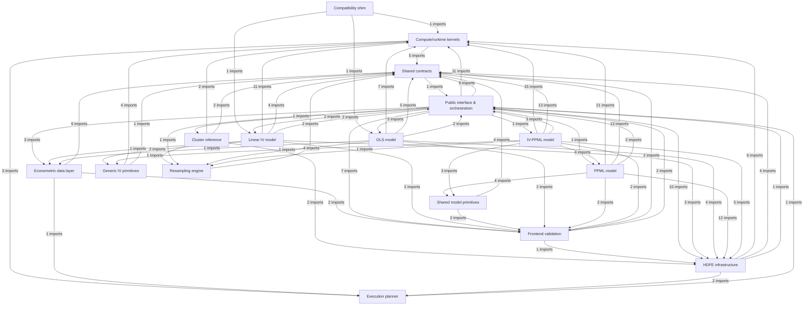
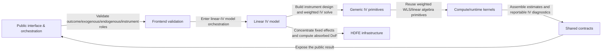
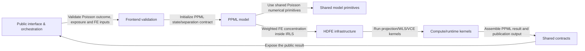
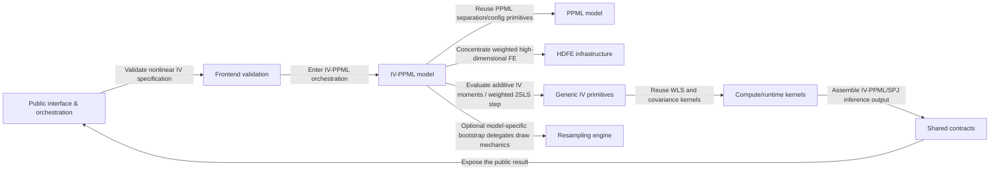
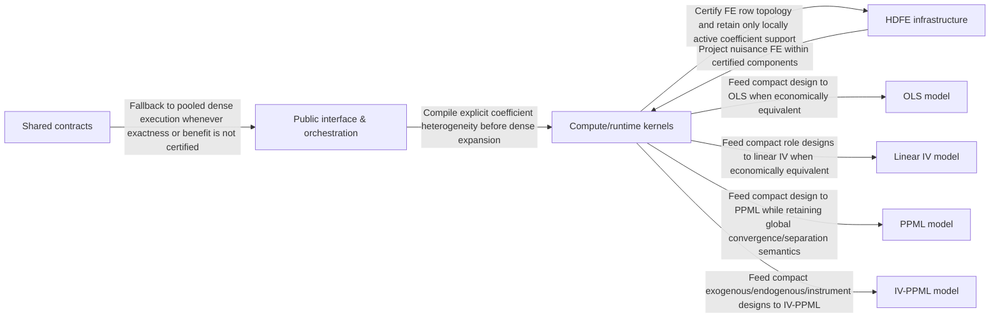
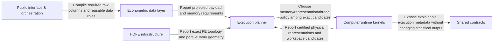
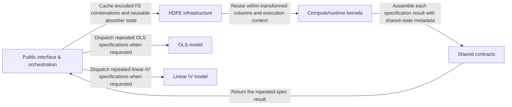

# econhdfe architecture map — 0.6.3

> Generated by `skills/econhdfe/scripts/architecture_map.py`. Do not hand-edit generated topology; update the generator or source code and regenerate.

This document is the compact, evidence-backed code map for contributor onboarding. The import graph below is recovered from Python ASTs. The execution flows are semantic overlays verified against the estimator orchestration modules; they are intentionally separated from import dependency claims.

## Bird's-eye view

The diagram collapses files into stable architectural groups. `__init__.py` re-export imports are excluded from the edge counts so the graph reflects implementation dependencies rather than public namespace wiring.

## Codemap

| If you need to change… | Start here |
| --- | --- |
| Choose the estimator implied by the empirical specification | `econhdfe/api.py` / `econhdfe/__init__.py` |
| Validate economic variable roles before estimation | `econhdfe/frontend/` |
| Compile factor interactions / event-study / group-specific slopes | `econhdfe/design.py` / `factorvars.py` / `compute/design_plan.py` |
| Reuse work across regression-table robustness specifications | `econhdfe/sessions.py` |
| Partial out high-dimensional observed heterogeneity | `econhdfe/hdfe/absorber.py` / `plan.py` / `numerical_core.py` / `projection.py` |
| Count absorbed nuisance parameters / residual degrees of freedom | `econhdfe/hdfe/rank.py` / `dof.py` |
| Represent exclusion restrictions and IV orthogonality conditions | `econhdfe/iv/` |
| Estimate endogenous linear effects and diagnose weak instruments | `econhdfe/models/linear_iv/` |
| Estimate multiplicative effects for nonnegative outcomes / trade flows | `econhdfe/models/ppml/` |
| Estimate endogenous multiplicative effects and panel-bias corrections | `econhdfe/models/ppml_iv/` |
| Construct robust/clustered uncertainty and weighted least-squares sufficient statistics | `econhdfe/compute/` |
| Run bootstrap/resampling uncertainty calculations | `econhdfe/resampling/` |
| Diagnose cluster quality and few-cluster sensitivity | `econhdfe/inference/cluster/` |
| Return stable paper-facing estimates, diagnostics and structured failures | `econhdfe/errors.py` / `config.py` / `results.py` / `reporting.py` / `support_reports.py` |

## Architectural groups

### Compatibility shim

Preserves older reghdfe-style Python workflows so empirical projects can migrate without changing the econometric specification.

Files/modules: 2. pyreghdfe/__init__.py, pyreghdfe/linear.py

### Public interface & orchestration

Turns an empirical specification into the appropriate OLS, IV, PPML or IV-PPML workflow and manages repeated-specification research workflows.

Files/modules: 11. econhdfe/__init__.py, econhdfe/api.py, econhdfe/bootstrap.py, econhdfe/collinearity.py, econhdfe/design.py, … (+6)

### Frontend validation

Checks that outcomes, regressors, instruments, fixed effects, clusters and weights have economically valid roles before estimation.

Files/modules: 5. econhdfe/frontend/__init__.py, econhdfe/frontend/columns.py, econhdfe/frontend/report.py, econhdfe/frontend/roles.py, econhdfe/frontend/validate.py

### Econometric data layer

Projects, encodes and reuses only the raw observations/columns needed by the empirical specification while preserving sample identity.

Files/modules: 7. econhdfe/data/__init__.py, econhdfe/data/dataset.py, econhdfe/data/encoding.py, econhdfe/data/persistent.py, econhdfe/data/planner.py, … (+2)

### Execution planner

Separates exactness certificates from resource/cost policy and chooses memory, representation and parallel execution without changing the estimand.

Files/modules: 6. econhdfe/planner/__init__.py, econhdfe/planner/calibration.py, econhdfe/planner/contracts.py, econhdfe/planner/core.py, econhdfe/planner/report.py, … (+1)

### Shared contracts

Keeps estimator choices, inference conventions and paper-facing results consistent across model families.

Files/modules: 5. econhdfe/config.py, econhdfe/errors.py, econhdfe/reporting.py, econhdfe/results.py, econhdfe/support_reports.py

### OLS model

Estimates linear partial effects while controlling for high-dimensional observed heterogeneity; supplies OLS-specific resampling inference.

Files/modules: 2. econhdfe/models/ols.py, econhdfe/models/ols_bootstrap.py

### Linear IV model

Handles endogenous regressors in linear models and reports whether excluded instruments provide credible identifying variation.

Files/modules: 5. econhdfe/models/linear_iv/__init__.py, econhdfe/models/linear_iv/api.py, econhdfe/models/linear_iv/diagnostics.py, econhdfe/models/linear_iv/estimators.py, econhdfe/models/linear_iv/stock_yogo.py

### PPML model

Estimates nonnegative outcomes such as trade flows with multiplicative conditional means, high-dimensional FE and separation-safe inference.

Files/modules: 13. econhdfe/models/ppml/__init__.py, econhdfe/models/ppml/api.py, econhdfe/models/ppml/config.py, econhdfe/models/ppml/estimator.py, econhdfe/models/ppml/execution.py, … (+8)

### IV-PPML model

Addresses endogeneity in multiplicative/PPML models and finite-panel bias while retaining high-dimensional fixed effects.

Files/modules: 11. econhdfe/models/ppml_iv/__init__.py, econhdfe/models/ppml_iv/api.py, econhdfe/models/ppml_iv/bias.py, econhdfe/models/ppml_iv/bootstrap.py, econhdfe/models/ppml_iv/config.py, … (+6)

### Shared model primitives

Provides the common Poisson mean/link calculations used by PPML and IV-PPML so both models implement the same economic outcome process.

Files/modules: 2. econhdfe/models/__init__.py, econhdfe/models/poisson.py

### HDFE infrastructure

Controls for large sets of fixed effects and heterogeneous FE structures without estimating/reporting every nuisance coefficient explicitly.

Files/modules: 22. econhdfe/effects/__init__.py, econhdfe/effects/adapters.py, econhdfe/effects/diagnostics.py, econhdfe/effects/recover.py, econhdfe/effects/results.py, … (+17)

### Generic IV primitives

Represents the exclusion restrictions and orthogonality conditions that identify endogenous effects, independently of the outcome model.

Files/modules: 4. econhdfe/iv/__init__.py, econhdfe/iv/design.py, econhdfe/iv/moments.py, econhdfe/iv/solve.py

### Resampling engine

Runs bootstrap/resampling procedures used to quantify sampling uncertainty without embedding estimator-specific economic assumptions.

Files/modules: 4. econhdfe/resampling/__init__.py, econhdfe/resampling/engine.py, econhdfe/resampling/results.py, econhdfe/resampling/sampling.py

### Cluster inference

Supports credible inference when shocks are correlated within economic groups and cluster counts/balance make asymptotics fragile.

Files/modules: 4. econhdfe/inference/cluster/__init__.py, econhdfe/inference/cluster/diagnostics.py, econhdfe/inference/cluster/results.py, econhdfe/inference/cluster/wild.py

### Compute/runtime kernels

Executes the sufficient-statistic and matrix operations behind estimation while exploiting data structure so large empirical designs remain feasible.

Files/modules: 17. econhdfe/compute/__init__.py, econhdfe/compute/backend.py, econhdfe/compute/block_design.py, econhdfe/compute/clusters.py, econhdfe/compute/context.py, … (+12)

## Observed cross-group imports

| Source | Target | AST imports | Examples |
| --- | --- | ---: | --- |
| Cluster inference | Compute/runtime kernels | 2 | `econhdfe.inference.cluster.diagnostics → econhdfe.compute.clusters` `econhdfe.inference.cluster.wild → econhdfe.compute.clusters` |
| Cluster inference | Shared contracts | 2 | `econhdfe.inference.cluster.diagnostics → econhdfe.errors` `econhdfe.inference.cluster.wild → econhdfe.errors` |
| Cluster inference | HDFE infrastructure | 2 | `econhdfe.inference.cluster.wild → econhdfe.hdfe.absorber` `econhdfe.inference.cluster.wild → econhdfe.hdfe.two_way` |
| Cluster inference | Resampling engine | 1 | `econhdfe.inference.cluster.wild → econhdfe.resampling.sampling` |
| Compatibility shim | Compute/runtime kernels | 1 | `pyreghdfe.linear → econhdfe.compute.wls` |
| Compatibility shim | Linear IV model | 1 | `pyreghdfe.linear → econhdfe.models.linear_iv.estimators` |
| Compatibility shim | OLS model | 1 | `pyreghdfe.linear → econhdfe.models.ols` |
| Compute/runtime kernels | Shared contracts | 5 | `econhdfe.compute.clusters → econhdfe.errors` `econhdfe.compute.context → econhdfe.config` `econhdfe.compute.vcov → econhdfe.errors` `econhdfe.compute.weights → econhdfe.errors` |
| Compute/runtime kernels | Execution planner | 3 | `econhdfe.compute.execution → econhdfe.planner` `econhdfe.compute.partitioned_lstsq → econhdfe.planner` `econhdfe.compute.runtime → econhdfe.planner.resources` |
| Shared contracts | Public interface & orchestration | 1 | `econhdfe.support_reports → econhdfe` |
| Econometric data layer | Shared contracts | 6 | `econhdfe.data.dataset → econhdfe.errors` `econhdfe.data.encoding → econhdfe.errors` `econhdfe.data.persistent → econhdfe.errors` `econhdfe.data.persistent → econhdfe.results` `econhdfe.data.sample → econhdfe.errors` |
| Econometric data layer | Frontend validation | 2 | `econhdfe.data.dataset → econhdfe.frontend.columns` `econhdfe.data.persistent → econhdfe.frontend.columns` |
| Econometric data layer | Execution planner | 1 | `econhdfe.data.planner → econhdfe.planner` |
| Frontend validation | Shared contracts | 2 | `econhdfe.frontend.report → econhdfe.errors` `econhdfe.frontend.validate → econhdfe.errors` |
| Frontend validation | HDFE infrastructure | 1 | `econhdfe.frontend.columns → econhdfe.hdfe.specs` |
| Frontend validation | Public interface & orchestration | 2 | `econhdfe.frontend.columns → econhdfe.design` `econhdfe.frontend.columns → econhdfe.factorvars` |
| HDFE infrastructure | Compute/runtime kernels | 6 | `econhdfe.effects.adapters → econhdfe.compute.encoding` `econhdfe.effects.diagnostics → econhdfe.compute.encoding` `econhdfe.hdfe.absorber → econhdfe.compute.backend` `econhdfe.hdfe.block_projection → econhdfe.compute.block_design` `econhdfe.hdfe.block_projection → econhdfe.compute.design_plan` |
| HDFE infrastructure | Shared contracts | 4 | `econhdfe.effects.diagnostics → econhdfe.errors` `econhdfe.hdfe.absorber → econhdfe.errors` `econhdfe.hdfe.dof → econhdfe.results` `econhdfe.hdfe.factorvars → econhdfe.errors` |
| HDFE infrastructure | Public interface & orchestration | 1 | `econhdfe.hdfe.factorvars → econhdfe.factorvars` |
| HDFE infrastructure | Execution planner | 2 | `econhdfe.hdfe.projection → econhdfe.planner` `econhdfe.hdfe.projection → econhdfe.planner.calibration` |
| Public interface & orchestration | Cluster inference | 1 | `econhdfe.bootstrap → econhdfe.inference.cluster` |
| Public interface & orchestration | Compute/runtime kernels | 11 | `econhdfe.collinearity → econhdfe.compute.block_design` `econhdfe.design → econhdfe.compute.block_design` `econhdfe.design → econhdfe.compute.design_plan` `econhdfe.design → econhdfe.compute.execution` `econhdfe.pipeline → econhdfe.compute.encoding` |
| Public interface & orchestration | Shared contracts | 9 | `econhdfe.api → econhdfe.config` `econhdfe.api → econhdfe.reporting` `econhdfe.design → econhdfe.errors` `econhdfe.factorvars → econhdfe.errors` `econhdfe.sessions → econhdfe.config` |
| Public interface & orchestration | Econometric data layer | 3 | `econhdfe.sessions → econhdfe.data.dataset` `econhdfe.sessions → econhdfe.data.persistent` `econhdfe.sessions → econhdfe.data.source` |
| Public interface & orchestration | Frontend validation | 7 | `econhdfe.design → econhdfe.frontend.validate` `econhdfe.design → econhdfe.frontend.roles` `econhdfe.pipeline → econhdfe.frontend.validate` `econhdfe.pipeline → econhdfe.frontend.roles` `econhdfe.sessions → econhdfe.frontend.columns` |
| Public interface & orchestration | HDFE infrastructure | 10 | `econhdfe.pipeline → econhdfe.hdfe.absorber` `econhdfe.pipeline → econhdfe.hdfe.two_way` `econhdfe.pipeline → econhdfe.hdfe.group_individual` `econhdfe.pipeline → econhdfe.hdfe.dof` `econhdfe.pipeline → econhdfe.hdfe.structure` |
| Public interface & orchestration | Linear IV model | 2 | `econhdfe.api → econhdfe.models.linear_iv.api` `econhdfe.sessions → econhdfe.models.linear_iv.estimators` |
| Public interface & orchestration | OLS model | 3 | `econhdfe.api → econhdfe.models.ols` `econhdfe.bootstrap → econhdfe.models.ols_bootstrap` `econhdfe.sessions → econhdfe.models.ols` |
| Public interface & orchestration | PPML model | 1 | `econhdfe.api → econhdfe.models.ppml` |
| Public interface & orchestration | IV-PPML model | 1 | `econhdfe.api → econhdfe.models.ppml_iv` |
| Public interface & orchestration | Resampling engine | 1 | `econhdfe.bootstrap → econhdfe.resampling` |
| Generic IV primitives | Compute/runtime kernels | 4 | `econhdfe.iv.design → econhdfe.compute.wls` `econhdfe.iv.solve → econhdfe.compute.wls` `econhdfe.iv.solve → econhdfe.compute.stable_linalg` `econhdfe.iv.solve → econhdfe.compute.block_design` |
| Generic IV primitives | Shared contracts | 1 | `econhdfe.iv.design → econhdfe.errors` |
| Linear IV model | Compute/runtime kernels | 11 | `econhdfe.models.linear_iv.api → econhdfe.compute.weights` `econhdfe.models.linear_iv.api → econhdfe.compute.block_design` `econhdfe.models.linear_iv.diagnostics → econhdfe.compute.wls` `econhdfe.models.linear_iv.diagnostics → econhdfe.compute.encoding` `econhdfe.models.linear_iv.diagnostics → econhdfe.compute.vcov` |
| Linear IV model | Shared contracts | 4 | `econhdfe.models.linear_iv.api → econhdfe.errors` `econhdfe.models.linear_iv.api → econhdfe.config` `econhdfe.models.linear_iv.api → econhdfe.results` `econhdfe.models.linear_iv.api → econhdfe.reporting` |
| Linear IV model | Econometric data layer | 1 | `econhdfe.models.linear_iv.api → econhdfe.data` |
| Linear IV model | Frontend validation | 2 | `econhdfe.models.linear_iv.api → econhdfe.frontend.validate` `econhdfe.models.linear_iv.api → econhdfe.frontend.roles` |
| Linear IV model | HDFE infrastructure | 3 | `econhdfe.models.linear_iv.api → econhdfe.hdfe.dof` `econhdfe.models.linear_iv.api → econhdfe.hdfe.block_projection` `econhdfe.models.linear_iv.api → econhdfe.hdfe.plan` |
| Linear IV model | Public interface & orchestration | 2 | `econhdfe.models.linear_iv.api → econhdfe.pipeline` `econhdfe.models.linear_iv.api → econhdfe.design` |
| Linear IV model | Generic IV primitives | 2 | `econhdfe.models.linear_iv.estimators → econhdfe.iv.design` `econhdfe.models.linear_iv.estimators → econhdfe.iv.solve` |
| Shared model primitives | Shared contracts | 4 | `econhdfe.models.poisson → econhdfe.errors` |
| Shared model primitives | Frontend validation | 2 | `econhdfe.models.poisson → econhdfe.frontend.validate` `econhdfe.models.poisson → econhdfe.frontend.roles` |
| OLS model | Compute/runtime kernels | 7 | `econhdfe.models.ols → econhdfe.compute.weights` `econhdfe.models.ols → econhdfe.compute.wls` `econhdfe.models.ols → econhdfe.compute.stable_linalg` `econhdfe.models.ols → econhdfe.compute.vcov` `econhdfe.models.ols → econhdfe.compute.block_design` |
| OLS model | Shared contracts | 5 | `econhdfe.models.ols → econhdfe.errors` `econhdfe.models.ols → econhdfe.config` `econhdfe.models.ols → econhdfe.results` `econhdfe.models.ols → econhdfe.reporting` `econhdfe.models.ols_bootstrap → econhdfe.errors` |
| OLS model | Econometric data layer | 1 | `econhdfe.models.ols → econhdfe.data` |
| OLS model | Frontend validation | 2 | `econhdfe.models.ols → econhdfe.frontend.validate` `econhdfe.models.ols → econhdfe.frontend.roles` |
| OLS model | HDFE infrastructure | 4 | `econhdfe.models.ols → econhdfe.hdfe.dof` `econhdfe.models.ols → econhdfe.hdfe.block_projection` `econhdfe.models.ols → econhdfe.hdfe.plan` `econhdfe.models.ols_bootstrap → econhdfe.hdfe.absorber` |
| OLS model | Public interface & orchestration | 2 | `econhdfe.models.ols → econhdfe.pipeline` `econhdfe.models.ols → econhdfe.design` |
| OLS model | Resampling engine | 1 | `econhdfe.models.ols_bootstrap → econhdfe.resampling.sampling` |
| Execution planner | Public interface & orchestration | 1 | `econhdfe.planner.report → econhdfe` |
| PPML model | Compute/runtime kernels | 21 | `econhdfe.models.ppml.api → econhdfe.compute.context` `econhdfe.models.ppml.api → econhdfe.compute.wls` `econhdfe.models.ppml.estimator → econhdfe.compute.clusters` `econhdfe.models.ppml.estimator → econhdfe.compute.context` `econhdfe.models.ppml.estimator → econhdfe.compute.linalg` |
| PPML model | Shared contracts | 13 | `econhdfe.models.ppml.api → econhdfe.errors` `econhdfe.models.ppml.api → econhdfe.config` `econhdfe.models.ppml.config → econhdfe.errors` `econhdfe.models.ppml.estimator → econhdfe.errors` `econhdfe.models.ppml.estimator → econhdfe.config` |
| PPML model | Frontend validation | 2 | `econhdfe.models.ppml.api → econhdfe.frontend.validate` `econhdfe.models.ppml.api → econhdfe.frontend.roles` |
| PPML model | HDFE infrastructure | 12 | `econhdfe.models.ppml.api → econhdfe.hdfe.plan` `econhdfe.models.ppml.estimator → econhdfe.hdfe.plan` `econhdfe.models.ppml.execution → econhdfe.hdfe.plan` `econhdfe.models.ppml.execution → econhdfe.hdfe.weighted_projection` `econhdfe.models.ppml.heterogeneous → econhdfe.hdfe.block_projection` |
| PPML model | Public interface & orchestration | 2 | `econhdfe.models.ppml.api → econhdfe.design` `econhdfe.models.ppml.heterogeneous → econhdfe.design` |
| PPML model | Shared model primitives | 4 | `econhdfe.models.ppml.api → econhdfe.models.poisson` `econhdfe.models.ppml.heterogeneous → econhdfe.models.poisson` `econhdfe.models.ppml.irls → econhdfe.models.poisson` |
| IV-PPML model | Compute/runtime kernels | 15 | `econhdfe.models.ppml_iv.api → econhdfe.compute.context` `econhdfe.models.ppml_iv.api → econhdfe.compute.wls` `econhdfe.models.ppml_iv.api → econhdfe.compute.weights` `econhdfe.models.ppml_iv.estimator → econhdfe.compute.clusters` `econhdfe.models.ppml_iv.estimator → econhdfe.compute.context` |
| IV-PPML model | Shared contracts | 13 | `econhdfe.models.ppml_iv.api → econhdfe.errors` `econhdfe.models.ppml_iv.api → econhdfe.config` `econhdfe.models.ppml_iv.bias → econhdfe.errors` `econhdfe.models.ppml_iv.bootstrap → econhdfe.errors` `econhdfe.models.ppml_iv.config → econhdfe.errors` |
| IV-PPML model | Frontend validation | 2 | `econhdfe.models.ppml_iv.api → econhdfe.frontend.validate` `econhdfe.models.ppml_iv.api → econhdfe.frontend.roles` |
| IV-PPML model | HDFE infrastructure | 5 | `econhdfe.models.ppml_iv.api → econhdfe.hdfe.plan` `econhdfe.models.ppml_iv.estimator → econhdfe.hdfe.plan` `econhdfe.models.ppml_iv.heterogeneous → econhdfe.hdfe.block_projection` `econhdfe.models.ppml_iv.heterogeneous → econhdfe.hdfe.plan` `econhdfe.models.ppml_iv.irls → econhdfe.hdfe.plan` |
| IV-PPML model | Public interface & orchestration | 3 | `econhdfe.models.ppml_iv.api → econhdfe.design` `econhdfe.models.ppml_iv.heterogeneous → econhdfe.collinearity` `econhdfe.models.ppml_iv.heterogeneous → econhdfe.design` |
| IV-PPML model | Generic IV primitives | 4 | `econhdfe.models.ppml_iv.estimator → econhdfe.iv.moments` `econhdfe.models.ppml_iv.estimator → econhdfe.iv.solve` `econhdfe.models.ppml_iv.heterogeneous → econhdfe.iv.solve` `econhdfe.models.ppml_iv.irls → econhdfe.iv.solve` |
| IV-PPML model | Shared model primitives | 3 | `econhdfe.models.ppml_iv.api → econhdfe.models.poisson` `econhdfe.models.ppml_iv.heterogeneous → econhdfe.models.poisson` `econhdfe.models.ppml_iv.irls → econhdfe.models.poisson` |
| IV-PPML model | PPML model | 4 | `econhdfe.models.ppml_iv.config → econhdfe.models.ppml.config` `econhdfe.models.ppml_iv.estimator → econhdfe.models.ppml.separation` `econhdfe.models.ppml_iv.estimator → econhdfe.models.ppml.execution` `econhdfe.models.ppml_iv.heterogeneous → econhdfe.models.ppml.heterogeneous` |
| IV-PPML model | Resampling engine | 1 | `econhdfe.models.ppml_iv.bootstrap → econhdfe.resampling` |
| Resampling engine | Shared contracts | 2 | `econhdfe.resampling.engine → econhdfe.errors` `econhdfe.resampling.sampling → econhdfe.errors` |

## Representative execution flows

### OLS-HDFE

Estimate linear partial effects net of high-dimensional observed heterogeneity, then construct the requested inference.

```mermaid
flowchart LR
  n_interface["Public interface & orchestration"]
  n_frontend["Frontend validation"]
  n_interface -->|"Validate variable roles and data contract"| n_frontend
  n_ols["OLS model"]
  n_frontend -->|"Dispatch the linear model specification"| n_ols
  n_hdfe["HDFE infrastructure"]
  n_ols -->|"Compile/absorb requested fixed effects"| n_hdfe
  n_compute["Compute/runtime kernels"]
  n_hdfe -->|"Use grouped projection and numerical kernels"| n_compute
  n_contracts["Shared contracts"]
  n_compute -->|"Assemble covariance and stable result/reporting contracts"| n_contracts
  n_contracts -->|"Expose the public result"| n_interface
```

### Linear IV-HDFE

Identify linear causal/structural effects with excluded instruments while partialling out high-dimensional confounders.

### PPML-HDFE

Estimate multiplicative conditional-mean effects for nonnegative outcomes while absorbing high-dimensional heterogeneity and handling separation.

### IV-PPML-HDFE

Identify endogenous effects in multiplicative/PPML models using excluded instruments and high-dimensional fixed effects.

### Heterogeneous specifications

Accelerate event-study, group-specific-slope and interaction-rich specifications without changing the requested heterogeneous coefficients.

### Execution planning

Choose a feasible physical execution for a fixed econometric specification without allowing performance heuristics to alter identification or the estimand.

### Repeated specifications

Accelerate common empirical robustness workflows that repeatedly change outcomes, controls or FE sets across regression-table columns.

## Architectural invariants

- compute is estimator-agnostic and must not import HDFE, IV, or model implementations.
- hdfe may use compute, but numerical FE canonicalization/core reduction must not rewrite the requested inference topology.
- generic iv remains outcome-model agnostic; linear-IV and IV-PPML model layers consume it rather than importing one another.
- resampling owns draw mechanics only; estimator/inference-specific statistics remain outside resampling.
- standard CRV1 covariance remains in compute/VCE; advanced cluster diagnostics and WCR/WCU live in inference/cluster.
- public boundaries expose structured EconHDFEError codes without masking programmer failures.
- pyreghdfe is a compatibility surface; canonical implementation lives under econhdfe.

## Repository map

| Area | Files | Python | Markdown |
| --- | ---: | ---: | ---: |
| `econhdfe/` | 120 | 118 | 2 |
| `pyreghdfe/` | 2 | 2 | 0 |
| `tests/` | 65 | 65 | 0 |
| `validation/` | 25 | 8 | 3 |
| `benchmarks/` | 115 | 28 | 8 |
| `docs/` | 66 | 0 | 49 |
| `scripts/` | 22 | 19 | 0 |
| `skills/` | 17 | 4 | 12 |
| `compatibility/` | 23 | 0 | 0 |

## Visual companion

Open `architecture.html` for an interactive version of the same evidence: select an estimator flow to highlight participating layers, or click a node to inspect its files and AST-derived incoming/outgoing dependencies.

Machine-readable evidence is in `architecture.json`.
